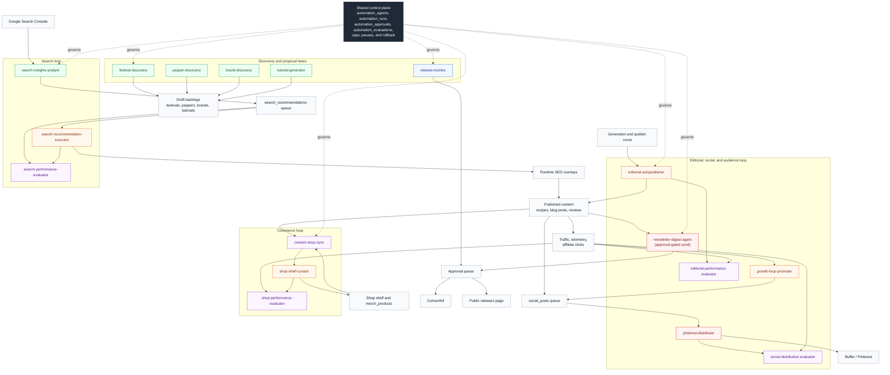
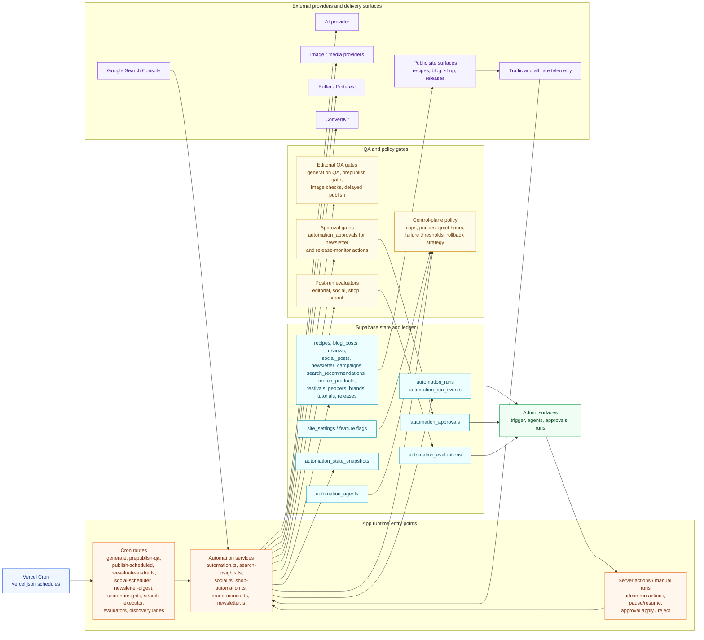

# Autonomous System Governance Plan

This document turns the current FlamingFoodies automation stack into an implementation plan for a safer, more fully autonomous system.

It is meant to sit next to [docs/autonomous-agents.md](/Users/vijaysingh/apps/flamingfoodies/docs/autonomous-agents.md) instead of replacing it.

`docs/autonomous-agents.md` explains the operating vision.

This file explains:

- which automations exist today
- which ones are low risk vs high risk
- which tables, flags, and wrappers to add
- how to roll the system out without breaking the current site

## Implementation Status

As of April 22, 2026:

- Phases 0 through 3 are implemented in the live control plane: registry, run ledger, policy enforcement, approvals, and the split Search Console analyst/executor model are all active.
- Phase 4 is active: `automation_evaluations` now stores keep / revert / escalate judgments, and the first automatic evaluator lane is live for Search executor runs.
- The first live Search evaluator verdicts are seeded in production: the executor recorded baseline snapshots and the evaluator wrote lag-aware `escalate` rows for the four currently applied Search recommendations.
- The first live editorial evaluator verdict is also seeded in production: one intentionally generated and published blog post was judged by `editorial-performance-evaluator`, which recorded a lag-aware `escalate` row against the publish run.
- The first live shop evaluator verdict is seeded in production: `shop-performance-evaluator` judged a prior `shop-shelf-curator` shelf refresh from snapshot-backed run evidence and recorded a lag-aware verdict against that run.
- Phase 5 is started: snapshot-backed rollback is now available for `search-recommendation-executor` and `shop-shelf-curator` from the admin run ledger.
- Evaluator loops are still early. Search, editorial, shop, and social all now have evaluator lanes in the repo; what remains is building enough live verdict history and operator confidence for Phase 4 to feel routine instead of newly landed.

## Concrete Next Execution Plan

This is the execution order from the current repo state.

Each slice should ship as its own commit, tag, and deploy checkpoint so the control plane stays auditable.

### Slice 1: Finish evaluator coverage for the other bounded-live loops

Goal:

- finish operationalizing the newer evaluator lanes so Phase 4 reads as an active practice instead of a freshly landed capability

Scope:

- smoke-test and seed `social-distribution-evaluator` with real source-run verdicts
- reuse `automation_evaluations` instead of creating another verdict table
- keep manual run controls and cron entry points wired and visible for each evaluator
- show evaluator verdict counts in `/admin/automation/agents`, `/admin/automation/runs`, and `/admin/automation/trigger`

Likely files:

- `lib/services/automation.ts`
- `lib/services/social.ts`
- `lib/services/shop-automation.ts`
- `lib/services/agent-runs.ts`
- `lib/autonomous-agents.ts`
- `lib/actions/admin-automation.ts`
- `app/api/admin/*-performance-evaluator/route.ts`
- `app/api/admin/*-performance-evaluator/cron/route.ts`
- `supabase/migrations/*` for agent seeding rows if new evaluator lanes are registered explicitly

Exit criteria:

- each evaluator writes real `automation_evaluations` rows tied to a prior source run
- each evaluator is visible as its own lane in the admin agent surfaces
- at least one manual smoke run exists for the social evaluator lane

### Slice 2: Finish rollback and snapshot coverage for the remaining live decision paths

Goal:

- complete Phase 5 for the live paths that still rely more on policy than on reversible state

Scope:

- add before/after snapshots or equivalent touched-entity payloads for `release-monitor` apply actions
- record touched entity lists for editorial publish batches even if rollback remains manual-only
- keep newsletter and Buffer sends as non-reversible, but log external action identifiers and exact send targets in the run payload
- expose rollback availability and rollback gaps clearly in the run ledger UI

Likely files:

- `lib/services/automation-control.ts`
- `lib/actions/admin-automation.ts`
- `lib/services/brand-monitor.ts`
- `lib/services/automation.ts`
- `lib/services/agent-runs.ts`
- `app/admin/automation/runs/page.tsx`

Exit criteria:

- release publication through `release-monitor` can be reversed from the run ledger or at minimum restored to its pre-apply state with a documented action
- editorial runs persist enough before/after context that operators can identify exactly what was published by a given run
- the run ledger shows which lanes are snapshot-backed, rebuild-backed, or manual-only for rollback

### Slice 3: Certify external-send lanes in production

Goal:

- prove that the guarded external-send model works end to end for newsletter and Pinterest/social, not just in theory

Scope:

- verify production Buffer API key, Pinterest channel mapping, and board target, then run a manual social distribution pass
- verify production ConvertKit configuration and a full newsletter approval-to-send pass
- confirm run-ledger output, cap usage, and pause behavior for both external-send lanes
- document the operator procedure for pausing, replaying, or rejecting sends

Likely files:

- `docs/production-go-live.md`
- `docs/autonomous-agents.md`
- `app/admin/automation/agents/page.tsx`
- `app/admin/automation/approvals/page.tsx`
- `app/admin/automation/trigger/page.tsx`
- `lib/services/agent-runs.ts`

Exit criteria:

- one successful manual newsletter approval-and-send cycle is recorded in `automation_runs`
- one successful manual Pinterest/social pass is recorded in `automation_runs`
- external-send agents show healthy last-run state and explicit approval/cap messaging in admin

### Slice 4: Tighten operator visibility and failure handling

Goal:

- make the control plane usable as a daily operating surface instead of only a development surface

Scope:

- add failure-streak, cap-usage, approval-backlog, evaluation-count, and rollback-readiness summaries to the agent cards
- make run drill-ins easier to follow from source run to approval to evaluation to rollback
- add explicit “blocked by policy” visibility for caps, quiet hours, paused state, and failure threshold cases
- document the weekly operator review routine

Likely files:

- `lib/services/agent-runs.ts`
- `app/admin/automation/agents/page.tsx`
- `app/admin/automation/runs/page.tsx`
- `app/admin/automation/trigger/page.tsx`
- `docs/production-go-live.md`

Exit criteria:

- an operator can answer “what ran, what changed, what is blocked, and what needs review” from admin without opening code
- failure and block states are visible as first-class statuses rather than hidden in summaries

### Slice 5: Close the rollout with a full autonomy certification pass

Goal:

- mark Phases 4 and 5 complete and convert the governance plan from “mid-rollout” to “operating baseline”

Scope:

- run a smoke checklist across each agent class: draft-only, bounded-live, approval-required, external-send, internal-support
- confirm every bounded-live lane has either snapshot rollback, rebuild rollback, or an explicit manual-only declaration
- confirm every external-send lane has approval gating, caps, and pause controls
- update the implementation status and go-live docs with the final verdict

Likely files:

- `docs/autonomous-system-governance-plan.md`
- `docs/production-go-live.md`
- `docs/autonomous-agents.md`

Exit criteria:

- every first-class agent has at least one recent run in the ledger
- every bounded-live agent has an explicit rollback strategy reflected in code and docs
- every external-send agent has a verified approval-and-send path
- the plan can honestly say Phase 4 and Phase 5 are complete

## Immediate Developer Tickets From Here

If we want the next developer agent to execute this in the highest-value order, hand it these tickets:

1. Seed and review `social-distribution-evaluator` with real verdict history, then surface its counts and health more clearly in admin.
2. Extend rollback/snapshot coverage for `release-monitor` apply actions and persist richer touched-entity evidence for editorial publish runs.
3. Run and document one production newsletter approval-and-send smoke test plus one production Pinterest/social smoke test.
4. Tighten operator surfaces so an admin can see rollback readiness, evaluation counts, and policy-block reasons without opening raw run payloads.
5. Do a full autonomy certification pass across every agent class after the remaining social/external-send slices land.

## Goals

1. Keep the current automation behavior working while adding stronger control and observability.
2. Give every autonomous lane an explicit policy, run ledger, kill switch, and mutation budget.
3. Separate low-risk draft-producing agents from live mutating agents and external-send agents.
4. Make it possible to pause, evaluate, and roll back each lane independently.

## Current Autonomy Snapshot

The live system is autonomous in a bounded sense, not in a fully unattended sense.

That means:

- most agents can already run on schedule without manual intervention
- the highest-risk actions still stop behind approvals or bounded allowlists
- the control plane can pause, cap, evaluate, and in some cases roll back live mutations
- the remaining work is mostly about maturing evaluator coverage, expanding rollback coverage, and finishing external-send certification

### Overall Agent Architecture Diagram

This diagram is keyed to the current registry in [lib/autonomous-agents.ts](/Users/vijaysingh/apps/flamingfoodies/lib/autonomous-agents.ts) and highlights every first-class agent lane that is currently modeled in code.



Color key:

- `Green` = `draft_only`
- `Amber` = `bounded_live`
- `Red` = `external_send`
- `Blue` = `approval_required`
- `Purple` = `internal_support`

### Runtime and Infrastructure Diagram

This view complements the agent topology above by making the execution surfaces explicit: scheduled cron entry points, manual admin triggers, QA and approval gates, shared automation tables, and the external providers each lane depends on.



What this second diagram adds that the agent topology does not:

- It shows that `vercel.json` cron routes and admin-triggered server actions are separate execution entry points into the same service layer.
- It makes the QA layer explicit, especially editorial/image checks and cuisine QA before autopublish decisions.
- It shows that approvals, runs, evaluations, and snapshots are distinct control-plane tables rather than one generic automation blob.
- It surfaces the operator loop: admins do not just watch the agents, they also pause lanes, apply approvals, rerun jobs, and inspect ledger history.
- It makes the provider dependency chain explicit for the AI provider, Search Console, Buffer/Pinterest, ConvertKit, and telemetry feedback.

### Known Modeling Gaps

The diagrams are now close to the real system, but two caveats are still worth keeping in view:

- `brand-monitor` still exists in the legacy `AutomationAgentId` union in [lib/services/automation-control.ts](/Users/vijaysingh/apps/flamingfoodies/lib/services/automation-control.ts:6), even though the active modeled lanes are now `brand-discovery` and `release-monitor`.
- Some cron-triggered behavior is still grouped as runtime entry points instead of first-class agents, especially shared generation and publish routes like `generate`, `reevaluate-ai-drafts`, and `publish-scheduled` from [vercel.json](/Users/vijaysingh/apps/flamingfoodies/vercel.json:3).

### Current Agent Maturity Matrix

| Agent | Class | Live today | What it changes | How bounded it is | What still keeps it from "fully autonomous" |
| --- | --- | --- | --- | --- | --- |
| `editorial-autopublisher` | `bounded_live` | yes | publishes recipes, blog posts, reviews, and schedules social rows | QA-gated, delay-gated, capped by control plane | rollback is still mostly manual evidence rather than full restore |
| `editorial-performance-evaluator` | `internal_support` | yes | writes verdicts to `automation_evaluations` | never mutates public state directly | exists, but editorial still needs stronger rollback evidence |
| `pinterest-distributor` | `external_send` | yes | pushes queued social posts to Buffer / Pinterest | caps, pauses, provider-level failure handling | now paired with the social evaluator lane, but still needs stronger operator messaging for provider limits and ongoing live certification |
| `growth-loop-promoter` | `bounded_live` | yes | re-queues winner pages into social distribution | dedupe, winner thresholds, daily caps | now has evaluator coverage, but still depends on clean social telemetry and queue hygiene to stay trustworthy |
| `shop-shelf-curator` | `bounded_live` | yes | updates shop ranking and merch picks | bounded write surface plus snapshot-backed rollback | evaluator now exists, but the lane still needs more live verdict history before it feels fully mature |
| `shop-performance-evaluator` | `internal_support` | yes | writes shop verdicts to `automation_evaluations` | judges snapshot-backed curator runs without mutating the public shelf directly | still early, and needs more live verdict history plus operator review patterns |
| `newsletter-digest-agent` | `external_send` with `approval_required` send path | yes | drafts campaigns and can send approved campaigns | approval gate, caps, pause controls | still needs a full production approval-and-send certification pass |
| `search-insights-analyst` | `draft_only` | yes | refreshes `search_recommendations` queue from GSC data | no live page writes | intentionally not a live executor |
| `search-recommendation-executor` | `bounded_live` | yes | applies approved runtime SEO overlays | approved-only queue, allowlisted implementation registry, snapshots | bounded on purpose; unsupported items still require manual review |
| `search-performance-evaluator` | `internal_support` | yes | writes search verdicts to `automation_evaluations` | no automatic rollback | already live, but search still relies on explicit human review for stronger corrective action |
| `festival-discovery` | `draft_only` | yes | inserts draft festival records | draft-only write surface | intentionally stops before live publishing |
| `pepper-discovery` | `draft_only` | yes | inserts draft pepper research rows | draft-only write surface | intentionally stops before live publishing |
| `brand-discovery` | `draft_only` | yes | inserts draft brand rows | draft-only write surface | intentionally stops before live publishing |
| `release-monitor` | `approval_required` | yes | creates release proposals and approval items | approval queue before public release changes | still needs stronger rollback evidence and operator certification |
| `tutorial-generator` | `draft_only` | yes | creates tutorial drafts | draft-only write surface | intentionally stops before live publishing |
| `content-shop-sync` | `internal_support` | yes | refreshes internal commerce/content signals | internal-only support job | not a user-facing autonomous publisher by design |

### Practical Answer: Are We Fully Autonomous?

Not yet, and that is the correct posture for this stage.

What is true today:

- the site already has a real multi-agent autonomous operating layer
- several loops are live, scheduled, and writing production state without manual babysitting
- search, editorial, shop, and social now all have evaluator lanes, so the biggest live loops are no longer one-way write pipelines

What is not true yet:

- not every live lane has equally mature evaluator history, rollback evidence, or operator-facing messaging yet
- every live lane does not yet have equally strong rollback coverage
- every external-send lane has not yet been production-certified end to end
- the highest-risk actions still and should still stop behind approval or allowlist boundaries

So the honest label is:

- `bounded autonomous system with real guardrails and live agent loops`
- not `fully unattended self-governing website`

## Current System Map

These are the meaningful autonomous or cron-driven lanes already in the repo.

| Lane | Current trigger | Current write surface | Current guardrail | Target autonomy class |
| --- | --- | --- | --- | --- |
| `editorial-autopublisher` | `generate`, `reevaluate-ai-drafts`, `publish-scheduled` crons | `recipes`, `blog_posts`, `reviews`, `social_posts` | AI QA + delayed publish window | `bounded_live` |
| `prepublish-qa` | scheduled cron + manual admin run | `recipes`, `blog_posts`, `reviews`, related `social_posts` scheduling state | rechecks scheduled drafts, moves failures to `needs_review`, persists `qa_issues` | `internal_support` |
| `editorial-performance-evaluator` | daily cron | `automation_evaluations` | lag-aware verdicts only, no direct live mutations | `internal_support` |
| `pinterest-distributor` / social scheduler | daily cron | `social_posts`, Buffer publish | platform queue only, provider failure handling | `external_send` |
| `growth-loop-promoter` | daily cron | `social_posts` queue | max 2 candidates + 7-day dedupe | `bounded_live` |
| `shop-shelf-curator` | daily pick + nightly refresh | `merch_products`, generation jobs | bounded catalog writes, featured-slot logic | `bounded_live` |
| `shop-performance-evaluator` | daily cron | `automation_evaluations` | snapshot-backed verdicts only, no direct shelf mutations | `internal_support` |
| `newsletter-digest-agent` | weekly digest cron + daily due-send cron | `newsletter_campaigns`, automation approvals, ConvertKit broadcast sync | digest drafting is autonomous, but sending is approval-gated and only approved due campaigns can go out | `external_send` |
| `search-insights-analyst` | weekly cron | `search_insight_runs`, `search_recommendations` | read-only Search Console sync + queue only | `draft_only` |
| `search-recommendation-executor` | daily cron | `search_recommendations`, `site_settings.search_runtime_optimizations` | approved-only bounded overlay registry | `bounded_live` |
| `search-performance-evaluator` | daily cron | `automation_evaluations` | delayed verdicts on prior executor runs, no automatic rollback | `internal_support` |
| `festival-discovery` | nightly cron | `festivals` drafts | draft-only inserts | `draft_only` |
| `pepper-discovery` | weekly cron | pepper discovery tables | draft-oriented discovery flow | `draft_only` |
| `brand-discovery` | weekly cron | `brands` drafts | draft-only brand research rows | `draft_only` |
| `release-monitor` | weekly cron | `automation_approvals`, approved `releases` publishes | release proposals stop in approval until an admin applies them | `approval_required` |
| `tutorial-generator` | weekly cron | `tutorials` drafts | draft-only insert | `draft_only` |
| `content-shop-sync` | daily cron | shop/content signal tables | internal signal sync | `internal_support` |

Editorial publish rule:

- scheduled recipes, blog posts, and reviews must pass prepublish QA before auto-publish
- failing rows must move to `needs_review` with persisted `qa_issues`
- post-publish evaluators and visual QA are support loops, not substitutes for the publish gate

## Main Problems To Solve

### 1. No single control plane

The cron surface in [vercel.json](/Users/vijaysingh/apps/flamingfoodies/vercel.json) is broader than the agent registry in [lib/autonomous-agents.ts](/Users/vijaysingh/apps/flamingfoodies/lib/autonomous-agents.ts).

That means:

- some jobs are live but not represented as first-class agents
- governance is split between service files, admin pages, and cron routes
- "what is autonomous" depends on where you look

### 2. Weak run-level observability

The current dashboard in [lib/services/agent-runs.ts](/Users/vijaysingh/apps/flamingfoodies/lib/services/agent-runs.ts) infers behavior from:

- generation jobs
- content status
- social rows
- newsletter rows
- audit log rows
- Search Console summaries

That is useful for reporting, but it is not a durable automation ledger.

We need explicit rows for:

- when each agent started
- what inputs it used
- what it changed
- what failed
- what should be rolled back

### 3. Uneven guardrails

The repo already has good patterns in some places:

- editorial auto-publish only happens after automated QA clears
- growth-loop re-promotion is capped and deduped
- Search Console execution is approval-gated and allowlisted
- festival and tutorial discovery write drafts instead of live content

But other places still need policy:

- social publishing touches external channels directly
- newsletter sending touches subscribers directly
- release monitoring currently auto-publishes AI-discovered release rows

### 4. No shared rollback model

The system can often rebuild state, but it does not yet record before/after snapshots in a shared way.

That is acceptable for low-risk draft lanes.

It is not acceptable for:

- live SEO runtime overlays
- social sends
- newsletter sends
- live release publishing
- shop shelf changes

## Risk Classes

Every agent should be assigned one of these classes.

### `draft_only`

The agent can create or update draft records, but it cannot publish or send anything externally.

Use for:

- `festival-discovery`
- `pepper-discovery`
- `tutorial-generator`
- `search-insights-analyst`
- `brand-discovery` after splitting brand monitor

### `bounded_live`

The agent can make live changes, but only inside a pre-modeled write surface with caps and rollback support.

Use for:

- `editorial-autopublisher`
- `growth-loop-promoter`
- `shop-shelf-curator`
- `search-recommendation-executor`

### `external_send`

The agent can send or publish externally to a third-party audience or platform.

Use for:

- `pinterest-distributor`
- `newsletter-digest-agent`

### `approval_required`

The agent may prepare live actions, but a human or explicit approval policy must clear them before execution.

Use for:

- `release-monitor`
- future high-risk social or email campaigns
- any future code-writing or infrastructure-mutating agent

### `internal_support`

The job is important operationally, but it is not a user-facing autonomous lane.

Use for:

- `content-shop-sync`

## Proposed Data Model

### 1. `automation_agents`

Purpose:
- one row per autonomous lane
- policy and schedule source of truth
- kill switches and budgets live here

Suggested columns:

```sql
create table automation_agents (
  agent_id text primary key,
  name text not null,
  category text not null,
  risk_class text not null,
  autonomy_mode text not null,
  is_enabled boolean not null default true,
  requires_manual_approval boolean not null default false,
  schedule_cron text null,
  owner text null,
  daily_run_cap integer null,
  daily_mutation_cap integer null,
  daily_external_send_cap integer null,
  quiet_hours_start_et smallint null,
  quiet_hours_end_et smallint null,
  max_consecutive_failures integer not null default 3,
  alert_after_minutes integer not null default 120,
  rollback_strategy text not null default 'none',
  config jsonb not null default '{}'::jsonb,
  created_at timestamptz not null default now(),
  updated_at timestamptz not null default now()
);
```

Recommended `autonomy_mode` values:

- `disabled`
- `draft_only`
- `approval_required`
- `bounded_live`
- `external_send`

Recommended `rollback_strategy` values:

- `none`
- `rebuild_from_source`
- `restore_snapshot`
- `manual_only`

### 2. `automation_runs`

Purpose:
- durable run ledger for every cron and manual trigger
- base table for dashboards, alerts, and failure handling

Suggested columns:

```sql
create table automation_runs (
  id bigserial primary key,
  agent_id text not null references automation_agents(agent_id),
  trigger_source text not null,
  trigger_reference text null,
  environment text not null default 'production',
  status text not null,
  started_at timestamptz not null default now(),
  completed_at timestamptz null,
  duration_ms integer null,
  summary text null,
  input_payload jsonb not null default '{}'::jsonb,
  result_payload jsonb not null default '{}'::jsonb,
  error_message text null,
  rows_created integer not null default 0,
  rows_updated integer not null default 0,
  rows_published integer not null default 0,
  rows_sent integer not null default 0,
  external_actions_count integer not null default 0,
  created_by_admin_id uuid null,
  rollback_run_id bigint null references automation_runs(id),
  created_at timestamptz not null default now()
);
```

Recommended `status` values:

- `started`
- `succeeded`
- `failed`
- `cancelled`
- `blocked`
- `rolled_back`

### 3. `automation_run_events`

Purpose:
- structured per-run log trail without dumping everything into one summary string

Suggested columns:

```sql
create table automation_run_events (
  id bigserial primary key,
  run_id bigint not null references automation_runs(id) on delete cascade,
  level text not null,
  code text not null,
  message text not null,
  payload jsonb not null default '{}'::jsonb,
  created_at timestamptz not null default now()
);
```

Recommended `level` values:

- `info`
- `warning`
- `error`

### 4. `automation_approvals`

Purpose:
- queue high-risk proposed actions before they become live
- shared approval primitive for SEO, release publishing, future newsletter sends, and future social campaigns

Suggested columns:

```sql
create table automation_approvals (
  id bigserial primary key,
  agent_id text not null references automation_agents(agent_id),
  subject_type text not null,
  subject_key text not null,
  proposed_action text not null,
  payload jsonb not null default '{}'::jsonb,
  status text not null default 'pending',
  source_run_id bigint null references automation_runs(id),
  approved_by_admin_id uuid null,
  rejected_by_admin_id uuid null,
  decision_reason text null,
  approved_at timestamptz null,
  rejected_at timestamptz null,
  expires_at timestamptz null,
  created_at timestamptz not null default now(),
  updated_at timestamptz not null default now()
);

create unique index automation_approvals_subject_idx
  on automation_approvals (agent_id, subject_type, subject_key, proposed_action);
```

Recommended `status` values:

- `pending`
- `approved`
- `rejected`
- `expired`
- `applied`

### 5. `automation_state_snapshots`

Purpose:
- save before/after payloads for live bounded lanes
- power rollback for SEO overlays, shop shelf state, and other deterministic state

Suggested columns:

```sql
create table automation_state_snapshots (
  id bigserial primary key,
  agent_id text not null references automation_agents(agent_id),
  run_id bigint not null references automation_runs(id) on delete cascade,
  scope text not null,
  subject_key text not null,
  before_payload jsonb not null default '{}'::jsonb,
  after_payload jsonb not null default '{}'::jsonb,
  created_at timestamptz not null default now()
);
```

### 6. `automation_evaluations`

Purpose:
- record post-run outcome checks
- give the system a path from "do work" to "was that a good idea"

Suggested columns:

```sql
create table automation_evaluations (
  id bigserial primary key,
  agent_id text not null references automation_agents(agent_id),
  source_run_id bigint not null references automation_runs(id),
  subject_type text not null,
  subject_key text not null,
  evaluation_window_days integer not null,
  baseline_payload jsonb not null default '{}'::jsonb,
  observed_payload jsonb not null default '{}'::jsonb,
  verdict text not null,
  notes text null,
  created_at timestamptz not null default now()
);
```

Recommended `verdict` values:

- `keep`
- `revert`
- `escalate`

## New Shared Service Layer

Add a shared wrapper instead of letting each service invent its own policy and logging.

Suggested new file:

- `lib/services/automation-control.ts`

Core functions:

```ts
getAutomationAgent(agentId)
assertAgentExecutionAllowed(agentId, triggerSource)
beginAutomationRun(agentId, input)
appendAutomationRunEvent(runId, event)
completeAutomationRun(runId, result)
failAutomationRun(runId, error)
recordAutomationSnapshot(runId, snapshot)
createAutomationApproval(input)
applyApprovedAutomation(input)
pauseAutomationAgent(agentId)
resumeAutomationAgent(agentId)
```

Every cron route should call the wrapper before running the underlying service.

That means:

- enforce agent enable/disable state
- enforce daily caps
- enforce quiet hours
- enforce failure-streak blocking
- record explicit run rows

## Global Safety Switches

Keep these in `site_settings` because they are true site-wide overrides.

Suggested keys:

- `automation_global_pause`
- `automation_external_send_pause`
- `automation_draft_creation_pause`
- `automation_default_quiet_hours_start_et`
- `automation_default_quiet_hours_end_et`

Keep existing settings in place:

- `auto_publish_ai_content`
- `auto_publish_delay_hours`

Use them as editorial-lane policy inputs rather than replacing them immediately.

## Agent-Specific Policy Defaults

These should be the first values inserted into `automation_agents`.

### `editorial-autopublisher`

- `risk_class = bounded_live`
- `autonomy_mode = bounded_live`
- `daily_run_cap = 6`
- `daily_mutation_cap = 8`
- `rollback_strategy = manual_only`

Guardrails:

- keep the embedded generation-time QA gate
- run dedicated prepublish QA shortly before scheduled publish
- rerun the same prepublish checks inline inside the publish lane as a fail-safe
- cap auto-published items per day
- block if failure streak exceeds threshold

### `pinterest-distributor`

- `risk_class = external_send`
- `autonomy_mode = external_send`
- `daily_external_send_cap = 12`
- `rollback_strategy = none`

Guardrails:

- retain 7-day per-content dedupe
- add per-platform per-day cap
- add quiet hours

### `growth-loop-promoter`

- `risk_class = bounded_live`
- `autonomy_mode = bounded_live`
- `daily_mutation_cap = 2`
- `rollback_strategy = rebuild_from_source`

Guardrails:

- keep max-2 candidate limit
- add content-type and platform caps
- add minimum traffic/share threshold config

### `shop-shelf-curator`

- `risk_class = bounded_live`
- `autonomy_mode = bounded_live`
- `daily_run_cap = 2`
- `daily_mutation_cap = 12`
- `rollback_strategy = restore_snapshot`

Guardrails:

- never hard-delete automated shop rows
- preserve exact-link preference
- snapshot featured set before each refresh

### `newsletter-digest-agent`

- `risk_class = external_send`
- `autonomy_mode = approval_required`
- `daily_external_send_cap = 1`
- `requires_manual_approval = true`
- `rollback_strategy = none`

Guardrails:

- drafting can stay autonomous
- sending should remain approval-gated until delivery quality is proven
- due-send logic should only process campaigns in `approved` or equivalent approved state
- returning a campaign to draft should expire the pending send approval instead of leaving stale queue state behind

### `search-insights-analyst`

- `risk_class = draft_only`
- `autonomy_mode = draft_only`
- `daily_run_cap = 1`
- `rollback_strategy = none`

Guardrails:

- no live runtime writes
- no status mutation except queue refresh

### `search-recommendation-executor`

- `risk_class = bounded_live`
- `autonomy_mode = bounded_live`
- `daily_mutation_cap = 6`
- `rollback_strategy = restore_snapshot`

Guardrails:

- keep approved-only queue behavior
- keep allowlisted implementation registry
- snapshot `search_runtime_optimizations` before rebuild

### `search-performance-evaluator`

- `risk_class = internal_support`
- `autonomy_mode = bounded_live`
- `daily_run_cap = 2`
- `daily_mutation_cap = 24`
- `rollback_strategy = none`

Guardrails:

- evaluate only prior executor runs, never raw analyst output
- write verdicts into `automation_evaluations`, not live site state
- do not auto-rollback runtime overlays without a separate explicit decision

### `festival-discovery`

- `risk_class = draft_only`
- `autonomy_mode = draft_only`

### `pepper-discovery`

- `risk_class = draft_only`
- `autonomy_mode = draft_only`

### `tutorial-generator`

- `risk_class = draft_only`
- `autonomy_mode = draft_only`

### `brand-discovery`

Split out of the current brand monitor service.

- `risk_class = draft_only`
- `autonomy_mode = draft_only`

### `release-monitor`

Split out of the current brand monitor service.

- `risk_class = approval_required`
- `autonomy_mode = approval_required`
- `requires_manual_approval = true`

Guardrail:

- stop auto-publishing AI-discovered release rows
- create draft or approval queue rows first

### `content-shop-sync`

- `risk_class = internal_support`
- `autonomy_mode = bounded_live`

Guardrail:

- keep it out of the public-facing autonomous-agent marketing copy
- still record it in the run ledger

## Required Refactors

### 1. Expand the agent registry

Update:

- [lib/autonomous-agents.ts](/Users/vijaysingh/apps/flamingfoodies/lib/autonomous-agents.ts)

Changes:

- include all currently scheduled lanes, not just the "headline" ones
- add `riskClass`, `autonomyMode`, `writesLiveState`, and `writesExternalState`
- separate first-class agents from support jobs in the UI

### 2. Wrap cron routes in the control layer

Update:

- `app/api/admin/generate/route.ts`
- `app/api/admin/prepublish-qa/route.ts`
- `app/api/admin/reevaluate-ai-drafts/route.ts`
- `app/api/admin/publish-scheduled/route.ts`
- `app/api/admin/social-scheduler/route.ts`
- `app/api/admin/growth-loop/route.ts`
- `app/api/admin/newsletter-digest/route.ts`
- `app/api/admin/shop-refresh/route.ts`
- `app/api/admin/search-insights/route.ts`
- `app/api/admin/search-insights-executor/cron/route.ts`
- discovery/support cron routes under `app/api/admin/*`

Changes:

- call `assertAgentExecutionAllowed`
- create a run row at start
- write structured success/failure output at finish

### 3. Add snapshots for bounded live lanes

Update:

- [lib/services/search-insights.ts](/Users/vijaysingh/apps/flamingfoodies/lib/services/search-insights.ts)
- [lib/services/shop-automation.ts](/Users/vijaysingh/apps/flamingfoodies/lib/services/shop-automation.ts)
- [lib/services/automation.ts](/Users/vijaysingh/apps/flamingfoodies/lib/services/automation.ts)

Changes:

- snapshot runtime overlay before SEO executor rebuild
- snapshot featured shop state before refresh
- for editorial, record promoted/published entity lists even if rollback stays manual

### 4. Split high-risk mixed agents

Update:

- [lib/services/brand-monitor.ts](/Users/vijaysingh/apps/flamingfoodies/lib/services/brand-monitor.ts)

Changes:

- split into `runBrandDiscovery()` and `runReleaseMonitor()`
- stop publishing `releases` rows directly from AI web-search output
- write drafts or `automation_approvals` instead

### 5. Fix newsletter autonomy intentionally

Update:

- [app/api/admin/newsletter-digest/route.ts](/Users/vijaysingh/apps/flamingfoodies/app/api/admin/newsletter-digest/route.ts)
- [lib/services/newsletter.ts](/Users/vijaysingh/apps/flamingfoodies/lib/services/newsletter.ts)
- [vercel.json](/Users/vijaysingh/apps/flamingfoodies/vercel.json)

Changes:

- keep weekly digest drafting autonomous
- gate send behavior behind approval or a specific approved status
- if fully autonomous send is desired later, require separate rollout after deliverability review

### 6. Replace inferred reporting with run-ledger reporting

Update:

- [lib/services/agent-runs.ts](/Users/vijaysingh/apps/flamingfoodies/lib/services/agent-runs.ts)
- `app/admin/automation/agents/page.tsx`
- `app/admin/automation/trigger/page.tsx`

Changes:

- use `automation_runs` as the primary truth for "what ran"
- keep inferred content metrics as supporting health signals
- add failure streak, muted/paused state, and cap status

## Admin Surface Changes

### `/admin/automation/agents`

Add:

- enabled/paused state
- risk class
- autonomy mode
- last successful run
- last failed run
- consecutive failure count
- next scheduled run
- daily cap usage

Split into sections:

- Live bounded agents
- External send agents
- Draft-only agents
- Support jobs

### `/admin/automation/runs`

New page.

Show:

- run ledger
- filters by agent, status, and date
- drill-in view for input, result, and event log

### `/admin/automation/approvals`

New page.

Show:

- pending approvals for release monitor, newsletter send, SEO, and future high-risk actions

### `/admin/automation/trigger`

Add:

- pause/resume controls
- run-now controls wired through the same control-plane wrapper
- explicit note when a lane is draft-only vs send-capable

## Rollout Order

### Phase 0: Inventory and no-behavior-change scaffolding

Scope:

- create `automation_agents`
- seed all current lanes
- create `automation_runs` and `automation_run_events`
- add the shared control wrapper
- wrap cron routes without changing lane behavior

Success criteria:

- every cron/manual automation writes a run row
- current behavior remains unchanged

### Phase 1: Unified dashboard and kill switches

Scope:

- update `lib/autonomous-agents.ts`
- update `lib/services/agent-runs.ts`
- add paused/enabled controls
- expose support jobs in the admin UI

Success criteria:

- every scheduled job is visible in one place
- any lane can be paused without code deploy

### Phase 2: Risk policy enforcement

Scope:

- enforce caps, quiet hours, and failure streak blocks
- add snapshotting for SEO and shop
- formalize policy defaults per lane

Success criteria:

- high-risk lanes stop when caps or failure thresholds are exceeded
- bounded live lanes write rollback-capable snapshots

### Phase 3: Approval queue for high-risk output

Scope:

- create `automation_approvals`
- split `brand-monitor`
- gate newsletter sending and release publication

Success criteria:

- no AI-web-researched content goes live externally without either policy approval or explicit human approval

### Phase 4: Evaluator loops

Scope:

- create `automation_evaluations`
- add SEO evaluator
- add social click/fatigue evaluator
- add editorial post-publish evaluator
- add shop CTR evaluator

Success criteria:

- the system can say not only "what ran" but also "was it worth keeping"

### Phase 5: Rollback tooling

Scope:

- rollback actions in admin
- restore snapshots for SEO/shop
- mark reverted runs in `automation_runs`

Success criteria:

- we can reverse bounded live mutations without hand-editing data tables

## First Developer Tickets

These are the first tickets a developer agent should execute in order.

1. Add `automation_agents`, `automation_runs`, and `automation_run_events` migrations.
2. Seed all current cron-driven lanes into `automation_agents`.
3. Create `lib/services/automation-control.ts`.
4. Wrap all cron routes with `beginAutomationRun` / `completeAutomationRun` / `failAutomationRun`.
5. Update `/admin/automation/agents` to read from `automation_agents` plus `automation_runs`.
6. Add pause/resume server actions and UI controls.
7. Snapshot `search_runtime_optimizations` before executor rebuild.
8. Snapshot shop featured state before catalog refresh.
9. Split `brand-monitor` into draft-only brand discovery and approval-gated release monitoring.
10. Add `automation_approvals` and `/admin/automation/approvals`.

## Non-Goals For This Rollout

- letting agents write arbitrary code
- letting agents create new public routes or templates on their own
- removing the current editorial QA gates
- turning every draft-only research lane into an auto-publishing lane

## Decision Summary

The target system is not "more aggressive automation."

It is:

- more explicit policy
- better run tracking
- stronger separation between draft creation, bounded live mutation, and external send
- rollback and evaluation before autonomy gets pushed harder
